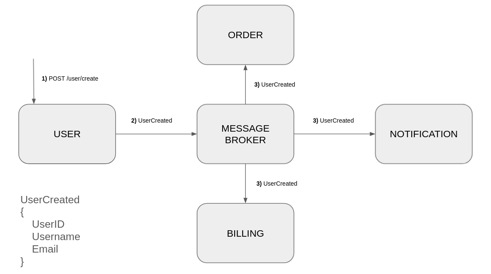
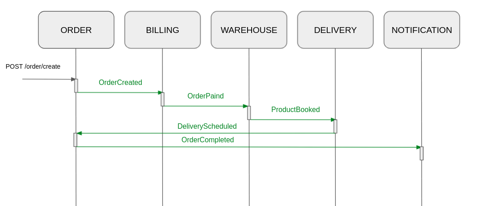
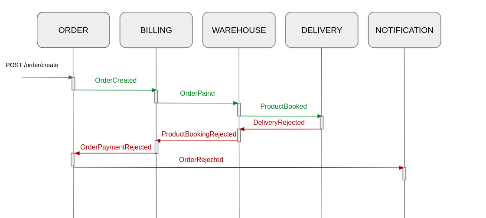
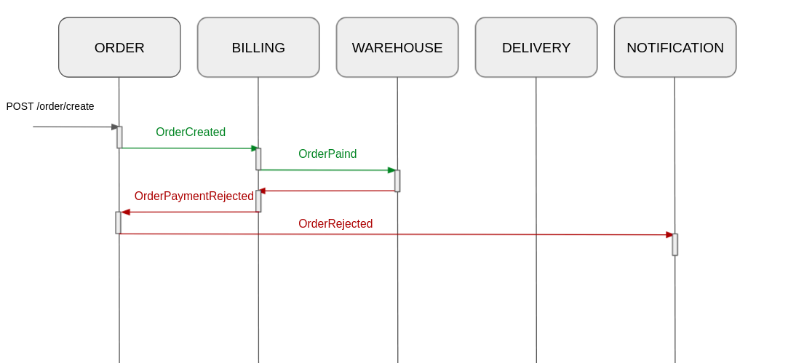
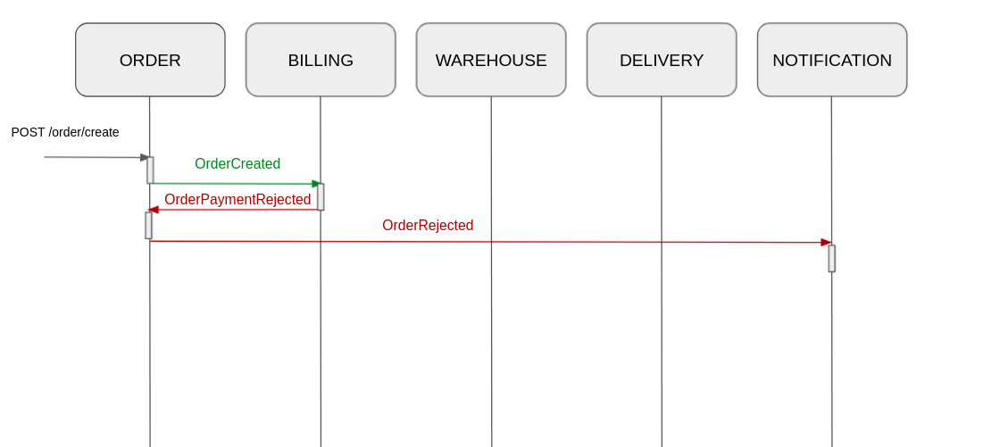

# Запуск простого приложения в helm

Архитектура решения

Описание api сарвисов и событий находится в папке api

Логинация


Аутентификация


Создание пользователя


Пополнение счёта


Создание заказа. Успешный сценарий


Создание заказа. Отклонение доставки.


Создание заказа. Отклонение бронирования на складе.


Создание заказа. Отклонение оплаты.


После установки нужно запустить Kubernetes. При необходимости можно изменить используемый драйвер с помощью
флага `--driver`.

```bash
minikube start \
--cpus=4 --memory=8g \
--cni=flannel \
--kubernetes-version="v1.19.0" \
--extra-config=apiserver.enable-admission-plugins=NamespaceLifecycle,LimitRanger,ServiceAccount,DefaultStorageClass,\
DefaultTolerationSeconds,NodeRestriction,MutatingAdmissionWebhook,ValidatingAdmissionWebhook,ResourceQuota,PodPreset \
--extra-config=apiserver.authorization-mode=Node,RBAC
```

Очистить неймспейс, если был создан ранее
```bash
kubectl delete namespace shop
```

Создаём наймспейс
```bash
kubectl create namespace shop
```

Ичпользуем наймспейс поумолчанию
```bash
kubectl config set-context --current --namespace=shop
```

Добавить необходимые рапозитории
```bash
helm repo add bitnami https://charts.bitnami.com/bitnami
helm repo add ingress-nginx https://kubernetes.github.io/ingress-nginx
helm repo update
```

Установить prometheus
```bash
helm install prom prometheus-community/kube-prometheus-stack -f microarch-chart/prometheus.yaml --atomic
```

Устанавливаем через хелм ингресс
```bash
helm install nginx ingress-nginx/ingress-nginx -f microarch-chart/nginx-ingress.yaml --atomic
```

Дождаться пока ингресс запустится

Запускаем grafana
```bash
kubectl port-forward service/prom-grafana 9000:80
```

Получить пароль
```bash
kubectl get secret prom-grafana -o jsonpath="{.data.admin-password}" | base64 --decode ; echo
```

Запускаем prometheus
```bash
kubectl port-forward service/prom-kube-prometheus-stack-prometheus 9090
```

Устанавливаем rabbitmq. В приложении можно отключить использование rabbitmq через параметр окружения AMQP_ENABLED.
```bash
helm install rabbitmq -f microarch-chart/rabbit.yaml bitnami/rabbitmq
```

Устанавливаем kafka. В приложении можно отключить использование kafka через параметр окружения KAFKA_ENABLED.
Если включить сразу rabbitmq и kafka, то приложения будет одновременно работать с двумя брокерами и проблем с этим не будет.
```bash
helm install kafka -f microarch-chart/kafka.yaml bitnami/kafka
```

Запустить чарт userauth. Долго запускается из-за кластера redis, нужно подождать.
```bash
helm install userauth ./microarch-chart/userauth
```

Запустить чарт userapp
```bash
helm install userapp ./microarch-chart/userapp
```

Запустить чарт billing
```bash
helm install billing ./microarch-chart/billing
```

Запустить чарт order
```bash
helm install order ./microarch-chart/order
```

Запустить чарт notification
```bash
helm install notification ./microarch-chart/notification
```

Запустить чарт delivery
```bash
helm install delivery ./microarch-chart/delivery
```

Запустить чарт product
```bash
helm install product ./microarch-chart/product
```

Запустить чарт warehouse
```bash
helm install warehouse ./microarch-chart/warehouse
```

Можно одной командой
```bash
minikube start \
--cpus=4 --memory=10g \
--cni=flannel \
--kubernetes-version="v1.19.0" \
--extra-config=apiserver.enable-admission-plugins=NamespaceLifecycle,LimitRanger,ServiceAccount,DefaultStorageClass,\
DefaultTolerationSeconds,NodeRestriction,MutatingAdmissionWebhook,ValidatingAdmissionWebhook,ResourceQuota,PodPreset \
--extra-config=apiserver.authorization-mode=Node,RBAC && \
kubectl create namespace shop && \
kubectl config set-context --current --namespace=shop && \
helm repo add bitnami https://charts.bitnami.com/bitnami && \
helm repo add ingress-nginx https://kubernetes.github.io/ingress-nginx && \
helm repo update && \
helm install prom prometheus-community/kube-prometheus-stack -f microarch-chart/prometheus.yaml --atomic && \
helm install nginx ingress-nginx/ingress-nginx -f microarch-chart/nginx-ingress.yaml --atomic --version 3.36.0 && \
helm install rabbitmq -f microarch-chart/rabbit.yaml bitnami/rabbitmq && \
helm install kafka -f microarch-chart/kafka.yaml bitnami/kafka && \
sleep 60 && \
helm install userauth ./microarch-chart/userauth && \
helm install userapp ./microarch-chart/userapp && \
helm install billing ./microarch-chart/billing && \
helm install order ./microarch-chart/order && \
helm install notification ./microarch-chart/notification && \
helm install delivery ./microarch-chart/delivery && \
helm install product ./microarch-chart/product && \
helm install warehouse ./microarch-chart/warehouse
```

Удалить сервисы
```bash
helm delete prom && \
helm delete nginx && \
helm delete rabbitmq && \
helm delete kafka && \
helm delete userauth && \
helm delete userapp && \
helm delete billing && \
helm delete order && \
helm delete notification && \
helm delete delivery && \
helm delete product && \
helm delete warehouse
```